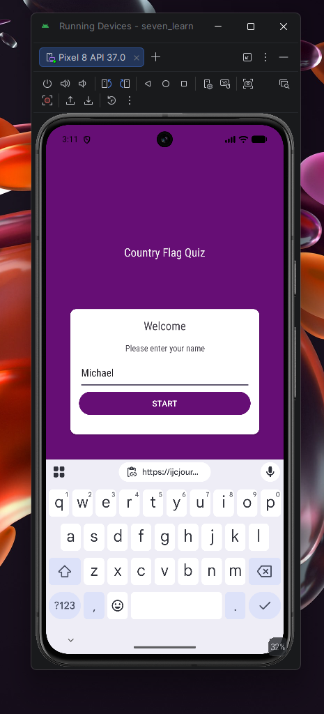
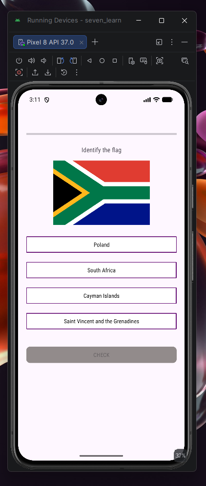
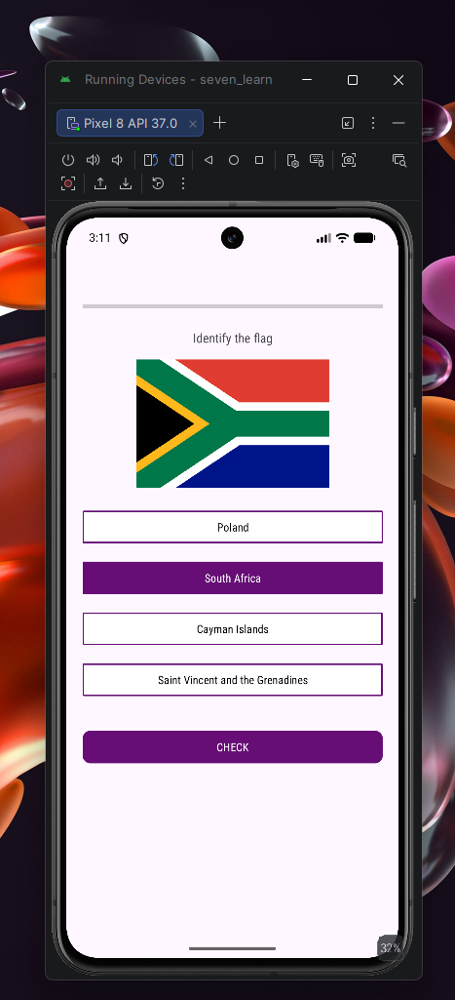
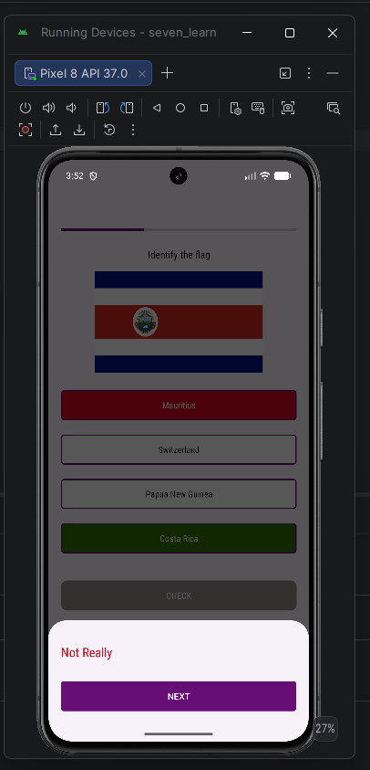
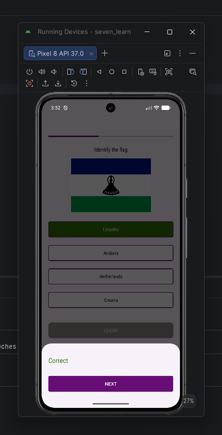
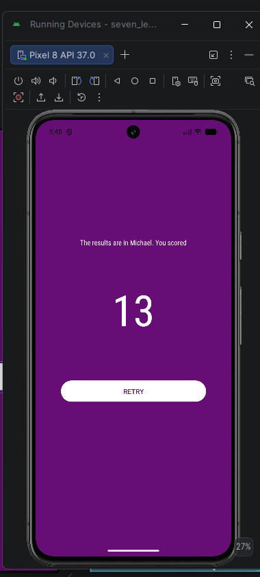

# ***SEVEN LEARN***

Android application built with Kotlin for a gamified learning experience.

Quizzes the user on a certain domain. Current domain available is Country Flags

Utilizes XML views

Target SDK 37, Minimum SDK 24

Target Java Version: 11

Kotlin: 2.4.20

