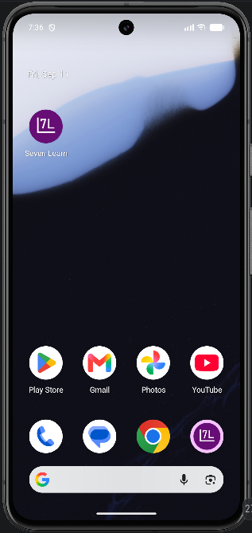
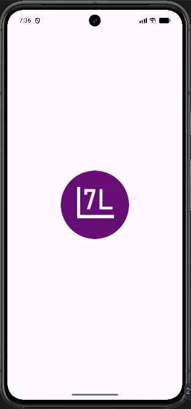
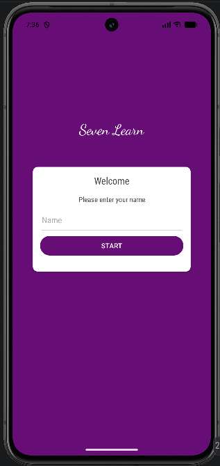
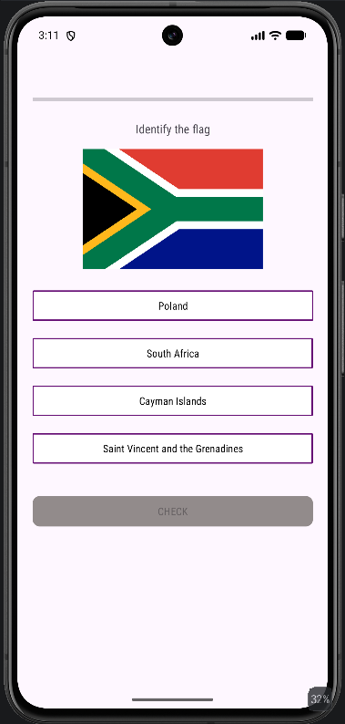
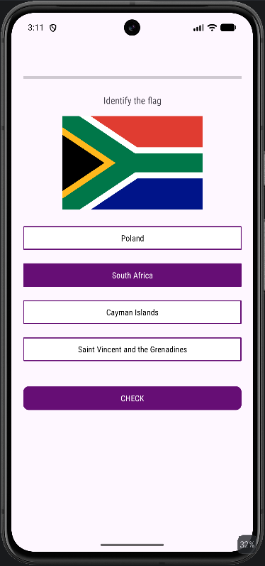
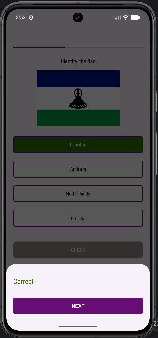
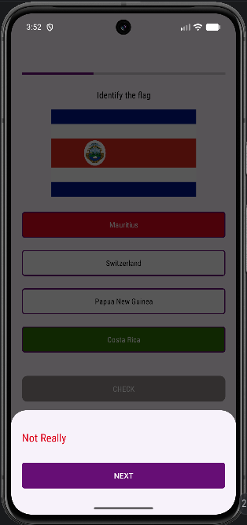
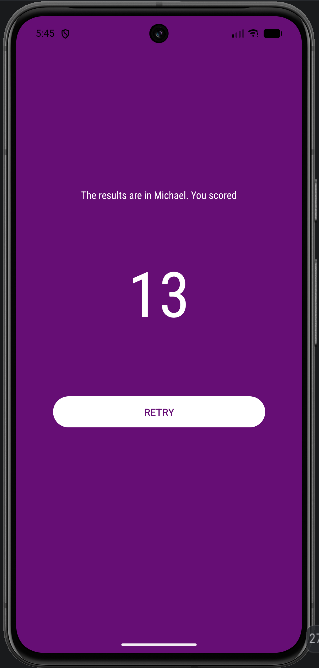

# ***SEVEN LEARN***

Android application built with Kotlin for a gamified learning experience.

Quizzes the user on a certain domain. Current domain available is Country Flags

Randomly generates 20 questions per session with 4 options per question from a store of flags from every country in the world according to the Alpha-2 (ISO 3166) specification

Utilizes XML views

@Parcelize's Custom objects for serialization

Utilizes InputFilters for EditTexts for input sanitization

Target SDK 37, Minimum SDK 24

Target Java Version: 11

Kotlin: 2.4.20

TODO: Remit  $25 for Android Developer registration fee in order to release app on Google Play Store

